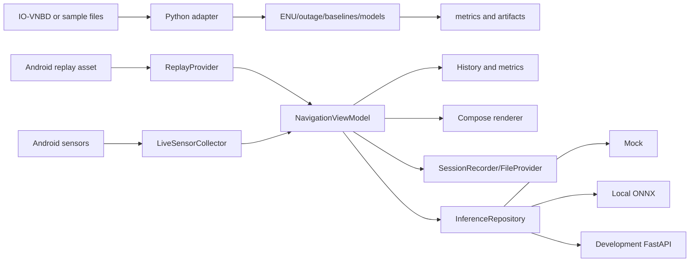

# AetherNav Architecture

The system has a Python research pipeline and an offline-first Android client.

## Mobile invariants

- Local ENU is the rendering and metric frame; the UI does not plot latitude/longitude directly.
- Replay uses monotonic sequence timestamps and is deterministic.
- History is bounded at 10,000 points to avoid unbounded memory growth.
- Reference, baseline, and AetherNav paths are stored separately.
- Live sensor timestamps are based on Android monotonic sensor/location clocks. No orientation compensation is applied until a tested transformation is available.
- Inference runs through a repository interface. ONNX initialization is off the UI thread and falls back explicitly when the model is absent or invalid.
- Export uses `FileProvider` `content://` URIs.
